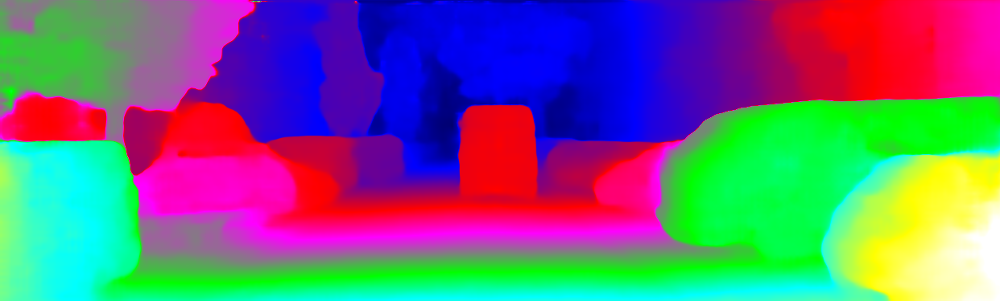
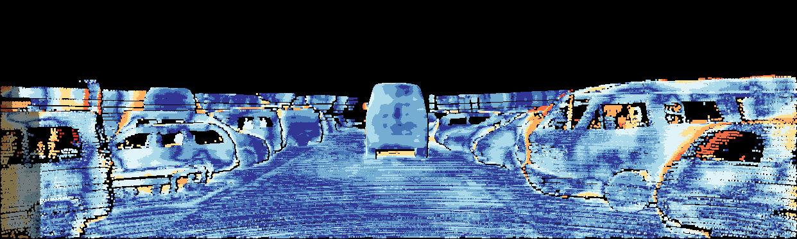
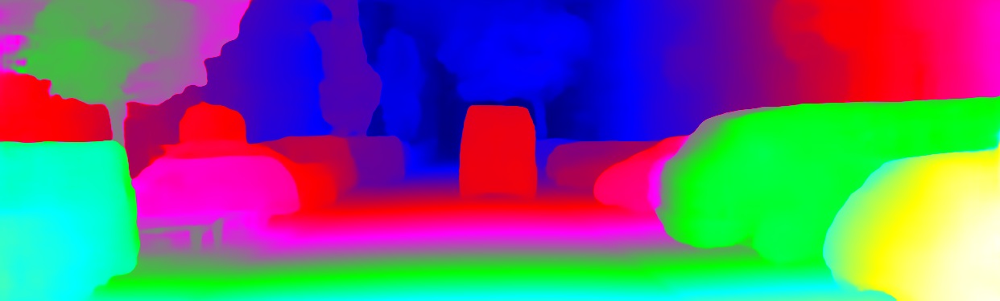
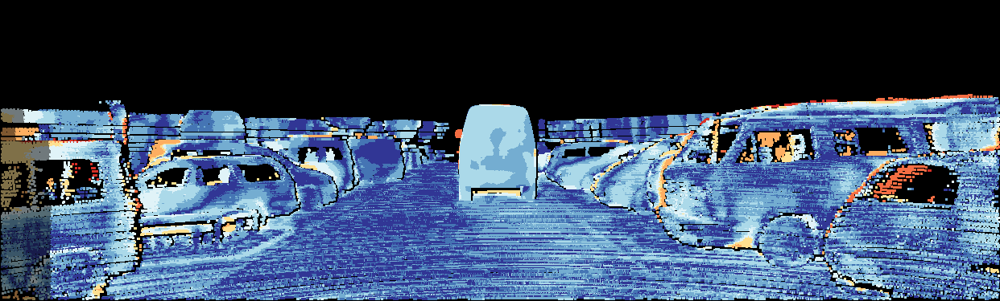

# MobileStereoNet
    

This repository contains the code for "MobileStereoNet: Towards Lightweight Deep Networks for Stereo Matching", presented at WACV 2022 [[Paper](https://openaccess.thecvf.com/content/WACV2022/papers/Shamsafar_MobileStereoNet_Towards_Lightweight_Deep_Networks_for_Stereo_Matching_WACV_2022_paper.pdf)] [[Supp](https://openaccess.thecvf.com/content/WACV2022/supplemental/Shamsafar_MobileStereoNet_Towards_Lightweight_WACV_2022_supplemental.pdf)] [[arXiv](https://arxiv.org/pdf/2108.09770.pdf)] [[Video Presentation](https://www.youtube.com/watch?v=mui_M2OcZG8)].

<div align="center">
    
    <p> <b>Input image</b> </p>
    
    
    <p> <b>2D-MobileStereoNet prediction</b> </p>
    
    
    <p> <b>3D-MobileStereoNet prediction</b> </p>
</div>

## Evaluation Results 
MobileStereoNets are trained and tested using [SceneFlow](https://lmb.informatik.uni-freiburg.de/resources/datasets/SceneFlowDatasets.en.html) (SF), [KITTI](http://www.cvlibs.net/datasets/kitti/eval_stereo.php) and [DrivingStereo](https://drivingstereo-dataset.github.io/) (DS) datasets.  
In the following tables, the first columns show the training sets. For instance, in the case of "SF + KITTI2015", the model
is firstly pretrained on the SceneFlow dataset, and then finetuned on KITTI images.  
The results are reported in End-point Error (EPE); the lower, the better.   
Note that some experiments evaluate the zero-shot cross-dataset generalizability, e.g. when the model is trained on "SF + DS" and evaluated on "KITTI2015 val" or "KITTI2012 train".     
The related trained models are provided in the tables as hyperlinks.  

- 2D-MobileStereoNet  

|                                                                                                      | SF test | DS test       | KITTI2015 val | KITTI2012 train |
|:-----------------------------------------------------------------------------------------------------|:-------:|:-------------:|:-------:|:---------------:|
| [SF](https://drive.google.com/file/d/14g0SAmcHPQD55lvkGp0iovZxn__3xsvl/view?usp=sharing)             | **1.14**|    6.59       |    2.42 |       2.45      |
| [DS](https://drive.google.com/file/d/1__-8srxXXum6U1fBTVmZN1mQjDUZO55n/view?usp=sharing)             |    -    |    **0.67**   |    1.02 |       0.96      |
| [SF + DS](https://drive.google.com/file/d/1ISCXF0zr_HGZjG93-yQcGm0MKKPRHg0z/view?usp=sharing)        |    -    |    0.73       |    1.04 |       1.04      |
| [SF + KITTI2015](https://drive.google.com/file/d/1d7WbQj2o6LaVUv3wx2ZVa0fsVIF161TU/view?usp=sharing) |    -    |    1.41       |    0.79 |       1.18      |
| [DS + KITTI2015](https://drive.google.com/file/d/1ubbyuJK6YjnqL_kNtVDDd8-oS_YhP2__/view?usp=sharing) |    -    |    0.79       |    **0.65** |       0.91      |
| [SF + DS + KITTI2015](https://drive.google.com/file/d/1Y2Q7qcwjls0ThVpQFvFy3nXR0TBCal9y/view?usp=sharing)                                                                              |    -    |    0.83       |    0.68  |       **0.90**  |

- 3D-MobileStereoNet  

|                                                                                                           | SF test | DS test |  KITTI2015 val| KITTI2012 train |
|:----------------------------------------------------------------------------------------------------------|:-------:|:-------------:|:-------:|:---------------:|
| [SF](https://drive.google.com/file/d/1rkVOtDi8a4e4D2vZIYjxQwy9foJSanjQ/view?usp=sharing)                  | **0.80**|    4.50    |      10.30 |       9.38      |
| [DS](https://drive.google.com/file/d/1p5Bk9tg3J-L9xDa6Lmx0gDLdf-8OePs_/view?usp=sharing)                  |    -    |     0.60      |     1.16|       1.14      |
| [SF + DS](https://drive.google.com/file/d/100vKF1zXp9bTDGEQ3dZGtw5BRRPj_nag/view?usp=sharing)             |    -    |   **0.57**       | 1.12 |       1.10      |
| [SF + KITTI2015](https://drive.google.com/file/d/1nuZGusAJQL3cRIvv341h0Gwqzc5zKCxg/view?usp=sharing)      |    -    |  1.53        |    0.65  |       0.90      |
| [DS + KITTI2015](https://drive.google.com/file/d/1tFEPVYK5_UMzeGa5n1Y21F4ymbibBPps/view?usp=sharing)                                                                                        |    -    |   0.65      |     0.60  |       0.85      |
| [SF + DS + KITTI2015](https://drive.google.com/file/d/1yr94c77P9cFCKiBH9Ie8d0ntieBkbRMW/view?usp=sharing) |    -    |   0.62  |     **0.59**  |     **0.83**    |

## Results on KITTI 2015 validation
[Predictions of difference networks](https://drive.google.com/file/d/1RW42Cyd1UAe7X-LiaN14iQZ_WA2FXcSx/view?usp=sharing)
## Results on KITTI 2015 Leaderboard
[Leaderboard](http://www.cvlibs.net/datasets/kitti/eval_scene_flow.php?benchmark=stereo)  
[2D-MobileStereoNet on the leaderboard](http://www.cvlibs.net/datasets/kitti/eval_scene_flow_detail.php?benchmark=stereo&result=53b8257acf35d19410db728c95e5e666890c5e27)  
[3D-MobileStereoNet on the leaderboard](http://www.cvlibs.net/datasets/kitti/eval_scene_flow_detail.php?benchmark=stereo&result=a1fd814aa8b2353df689233fb00bdaa227f380a8)

## Computational Complexity

Requirements for computing the complexity by two methods:  
```shell
pip install --upgrade git+https://github.com/sovrasov/flops-counter.pytorch.git
pip install --upgrade git+https://github.com/Lyken17/pytorch-OpCounter.git
pip install onnx
```
Run the following command to see the complexity in terms of number of operations and parameters.   
```shell
python cost.py
```
You can also compute the complexity of each part of the network separately. For this, the input size of each module has been written in `cost.py`.

## Installation

### Requirements
The code is tested on:
- Ubuntu 18.04
- Python 3.6 
- PyTorch 1.4.0 
- Torchvision 0.5.0
- CUDA 10.0

### Setting up the environment

```shell
conda env create --file mobilestereonet.yml
conda activate mobilestereonet
```


### SceneFlow Dataset Preparation

Download the finalpass images and the disparity data for SceneFlow FlyingThings3D, Driving and Monkaa.
For both, image and disparity data, move the directories in the TRAIN and TEST directories of the Driving and Monkaa Dataset (15mm_focallength/35mm_focallength for Driving,  funnyworld_x2 etc. for Monkaa) into the FlyingThings3D TRAIN and TEST directories, respectively.

It should look like this:

```
frames_finalpass
│
└───TEST
│   │
│   └───A
│   └───B
│   └───C
│   
│
└───TRAIN
│   │
│   └───15mm_focallength
│   └───35mm_focallength
│   └───A
│   └───a_rain_of_stones_x2
│   └─── ..
```

### Training 

Set a variable for the dataset directory, e.g. ```DATAPATH="/Datasets/SceneFlow/"```. Then, run ```train.py``` as below:

#### Pretraining on SceneFlow

```shell
python train.py --dataset sceneflow --datapath $DATAPATH --trainlist ./filenames/sceneflow_train.txt --testlist ./filenames/sceneflow_test.txt --epochs 20 --lrepochs "10,12,14,16:2" --batch_size 8 --test_batch_size 8 --model MSNet2D
```

#### Finetuning on KITTI

```shell
python train.py --dataset kitti --datapath $DATAPATH --trainlist ./filenames/kitti15_train.txt --testlist ./filenames/kitti15_val.txt --epochs 400 --lrepochs "200:10" --batch_size 8 --test_batch_size 8 --loadckpt ./checkpoints/pretrained.ckpt --model MSNet2D
```

The arguments in both cases can be set differently depending on the model, dataset and hardware resources.

### Prediction

The following script creates disparity maps for a specified model:

```shell
python prediction.py --datapath $DATAPATH --testlist ./filenames/kitti15_test.txt --loadckpt ./checkpoints/finetuned.ckpt --dataset kitti --colored True --model MSNet2D
```

## Credits

The implementation of this code is based on [PSMNet](https://github.com/JiaRenChang/PSMNet) and [GwcNet](https://github.com/xy-guo/GwcNet). Also, we would like to thank the authors of [THOP: PyTorch-OpCounter](https://github.com/Lyken17/pytorch-OpCounter), [Flops counter](https://github.com/sovrasov/flops-counter.pytorch) and [KITTI python utils](https://github.com/mattpoggi/kitti-utilities-python).

## License

This project is released under the [Apache 2.0 license](LICENSE).

## Citation

If you use this code, please cite this paper:  

```
@inproceedings{shamsafar2022mobilestereonet,
  title={MobileStereoNet: Towards Lightweight Deep Networks for Stereo Matching},
  author={Shamsafar, Faranak and Woerz, Samuel and Rahim, Rafia and Zell, Andreas},
  booktitle={Proceedings of the IEEE/CVF Winter Conference on Applications of Computer Vision},
  pages={2417--2426},
  year={2022}
}
```

## Contact
The repository is maintained by [Faranak Shamsafar](https://www.linkedin.com/in/faranak-shamsafar/).  
[f.shmsfr@gmail.com](f.shmsfr@gmail.com)  
